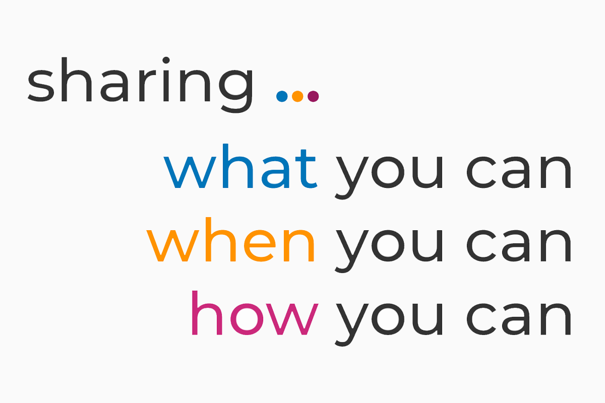

# Can I be a mentor? Yes!

## Can I be a mentor? Yes!

Everyone can mentor!

Regardless of your experience, how much time you have, what you know, etc., you can mentor.

The more mentorship we have, the more inclusive, collaborative, and innovative our communities become.

If you do not currently mentor, you may be thinking:

* Don’t have the time
* Not part of a formal program
* Not an expert
* Those are big shoes to fill \(a bit intimidating\)
* Am I giving the wrong advice? Too much advice?
* Why do I even need to/have to?

It does not have to be complicated, stressful or time-consuming. It can be formal or informal. It can be structured or organic and flexible.

Mentoring has various definitions, but in essence, it's all about helping.

> Mentoring is about sharing what you can, when you can, how you can.

**If you're already mentoring**, encourage a friend to get started as well and help guide them. In fact, you're probably mentoring already without knowing it -- thanks!

 

## Action steps

Coming soon ...

